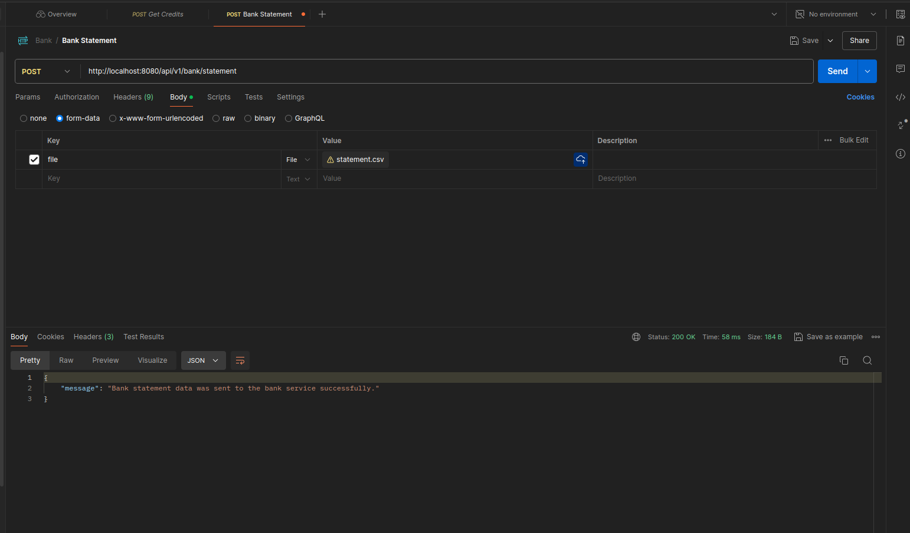
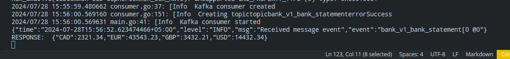

# Bank API and Bank Service

## Overview
This repository contains two services:

**bank_api**: A service that provides an API for managing bank statements. It produces messages related to bank statements, which are consumed by the bank_service.

**bank_service**: A microservice that consumes messages from the bank_api service and executes the messages to process bank statements.

## Project Structure
The repository is structured as follows:
```bash
.
├── bank_api
│   ├── Bank.postman_collection.json
│   ├── cmd
│   │   └── main.go
│   ├── config
│   │   └── local
│   │       ├── kafka.yaml
│   │       └── logger.yaml
│   ├── Dockerfile
│   ├── go.mod
│   ├── go.sum
│   ├── internal
│   │   ├── api
│   │   │   ├── bank_handler.go
│   │   │   └── router.go
│   │   ├── domain
│   │   │   ├── bank.go
│   │   │   └── errors.go
│   │   ├── errors
│   │   │   └── error.go
│   │   ├── kafka
│   │   │   ├── message.go
│   │   │   ├── producer.go
│   │   │   └── schemas
│   │   │       ├── bank_statement.go
│   │   │       ├── definitions
│   │   │       │   └── bank_v1_bank_statement.json
│   │   │       ├── init.go
│   │   │       └── topic.go
│   │   ├── repository
│   │   │   └── postgres
│   │   │       └── bank_repository.go
│   │   ├── service
│   │   │   └── bank_service.go
│   │   └── utils
│   │       ├── config.go
│   │       ├── logger.go
│   │       └── utils.go
│   ├── Makefile
│   ├── README(task) .txt
│   └── statement.csv
├── bank_service
│   ├── cmd
│   │   └── main.go
│   ├── config
│   │   └── local
│   │       ├── kafka.yaml
│   │       └── logger.yaml
│   ├── docker-compose.yml
│   ├── go.mod
│   ├── go.sum
│   ├── internal
│   │   ├── errors
│   │   │   └── error.go
│   │   ├── kafka
│   │   │   ├── consumer.go
│   │   │   ├── message.go
│   │   │   └── schemas
│   │   │       ├── bank_statement.go
│   │   │       ├── definitions
│   │   │       │   └── bank_v1_bank_statement.json
│   │   │       ├── init.go
│   │   │       └── topic.go
│   │   ├── service
│   │   │   ├── balance_service.go
│   │   │   ├── bank_service.go
│   │   │   └── kafka.go
│   │   └── utils
│   │       ├── config.go
│   │       ├── logger.go
│   │       ├── map.go
│   │       └── utils.go
│   └── Makefile
└── README.md
```

## Setup and Running the Services
### Prerequisites
- Docker
- Docker Compose
- Golang

## Running the Services
1. Navigate to the `bank_service` directory:
```bash
cd bank_service
```
2. Run the Kafka container using Make:
```bash
make run-kafka-container
````
This command will set up and start the Kafka container as defined in your Makefile.

3. Start the `bank_service` service:
```bash
make run
```

4. Open new terminal and navigate to the `bank_api` directory:
```bash
cd bank_api
```

5. Start the `bank_api` service:
```bash
make run
```
This command will start bank_api service.

## Output
API call response:


Microservice response:
